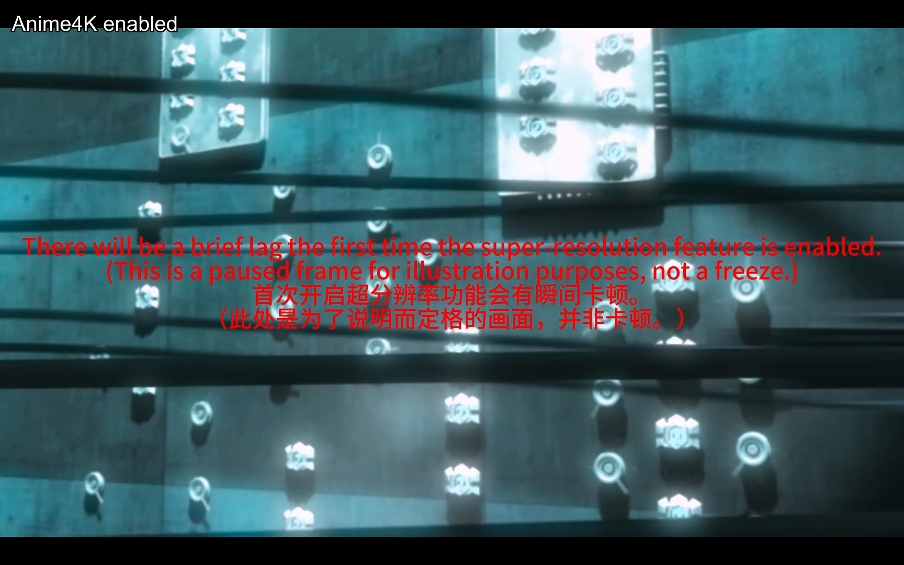
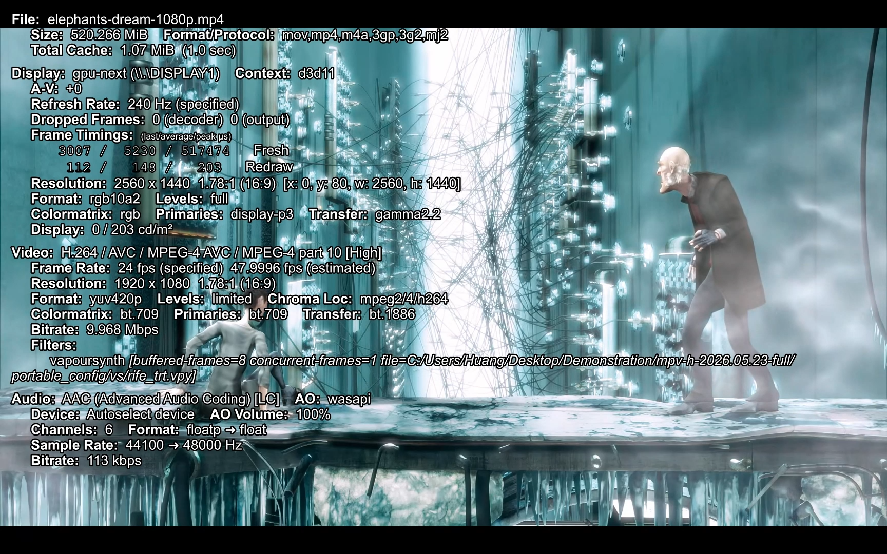

# mpv-h


English | [Simplified Chinese](README.zh-CN.md)

mpv-h is a personal Windows portable mpv setup. It combines mpv configuration, uosc, thumbfast, shader presets, and a VapourSynth/vsmlrt/TensorRT/RIFE interpolation profile.

This is not an official mpv build.


| Anime4K shader profile | RIFE frame interpolation |
| --- | --- |
|  |  |

[Watch the full demo video](https://github.com/ReadyPlayerHuang/mpv-h/releases/download/v2026.05.23/mpv-h-demo-v2026.05.23.mp4)

## Features

- Portable Windows mpv configuration.
- uosc interface and right-click menu.
- thumbfast thumbnail previews.
- Anime4K and FSRCNNX shader profile toggles.
- RIFE TensorRT interpolation toggle through VapourSynth.
- `mpv-h.exe` launcher that injects the bundled VapourSynth/vsmlrt runtime into mpv's process environment.
- Optional Windows file association install/uninstall scripts.

## Requirements

- Windows 10/11 x64.
- NVIDIA GPU for the bundled RIFE TensorRT profile.
- Recent NVIDIA driver. The first Release was tested with driver `596.36`; NVIDIA-SMI reported CUDA compatibility `13.2`.
- 7-Zip for extracting split Release archives.

The full Release package includes the required portable runtime: mpv, FFmpeg, yt-dlp, VapourSynth, vsmlrt, TensorRT runtime DLLs, CUDA runtime DLLs required by the bundled TensorRT stack, and ONNX models. It does not redistribute NVIDIA `trtexec.exe`. Users do not need to install the CUDA Toolkit, VapourSynth, Python, or the .NET SDK separately for normal playback.

## Download

Use the latest GitHub Release if you want a ready-to-run package. Download all archive parts into the same folder, then extract the `.7z.001` file with 7-Zip. Do not rename the `.001` / `.002` files.

The source repository is for configuration, scripts, launcher source, and documentation. Large runtime files such as `mpv.exe`, FFmpeg, yt-dlp, VapourSynth, TensorRT runtime files, CUDA runtime DLLs, and ONNX models are distributed through Releases instead of Git.

## RIFE TensorRT Setup

RIFE interpolation needs NVIDIA `trtexec.exe` to build a local TensorRT engine on first use. NVIDIA documents `trtexec` as a TensorRT command-line tool, but mpv-h does not redistribute it.

To enable first-time RIFE engine generation:

1. Download the matching TensorRT Windows zip from NVIDIA: <https://developer.nvidia.com/tensorrt>.
2. For this Release, the recommended NVIDIA direct link is <https://developer.nvidia.com/downloads/compute/machine-learning/tensorrt/10.14.1/zip/TensorRT-10.14.1.48.Windows.win10.cuda-13.0.zip>.
3. Extract the NVIDIA zip and copy `bin\trtexec.exe` to:

```text
mpv-h-2026.05.23-full\VapourSynth\Lib\site-packages\vapoursynth\plugins\vsmlrt-cuda\trtexec.exe
```

After the engine has been generated, later RIFE launches can reuse the local engine cache unless the GPU, driver, TensorRT runtime, model, precision, or input shape changes.

## Usage

For the full Release package:

1. Extract the archive.
2. Run `mpv-h.exe`.
3. Optionally run `installer/mpv-h-install.bat` as administrator to register mpv-h in Windows Default Apps.

To remove the Windows app registration, run:

```powershell
.\installer\mpv-h-uninstall.bat
```

## Shortcuts

| Shortcut | Action |
| --- | --- |
| `Alt+1` | Toggle Anime4K |
| `Alt+2` | Toggle FSRCNNX |
| `Alt+0` | Disable all GLSL shaders |
| `Alt+R` | Toggle RIFE TensorRT interpolation |
| `Alt+9` | Disable video filters and restore hardware decoding |
| Right click | Open uosc menu |

Anime4K/FSRCNNX shader upscaling and RIFE TensorRT interpolation are intentionally mutually exclusive. Running both at the same time is usually too heavy for smooth video playback. The profile also switches hardware decoding by workload: shader upscaling restores `hwdec=auto-safe`, while RIFE uses `hwdec=no` because this tested machine drops frames with hardware decoding enabled during VapourSynth interpolation.

## Repository Layout

```text
portable_config/        mpv configuration, scripts, uosc resources, fonts, shaders
tools/mpv-h-launcher/   launcher source code
installer/              Windows registration scripts and icon
scripts/                maintainer build and release packaging scripts
docs/                   configuration and release maintenance notes
LICENSES/               third-party license texts
```

## Known Assumptions

- The RIFE profile defaults to NVIDIA `device_id=0`.
- TensorRT engine files are generated locally on first use and should not be copied between machines.
- First RIFE startup can be slow while TensorRT builds an engine for the current GPU, driver, model, precision, and input shape.
- The default config is intentionally neutral. High-refresh-display tuning such as `display-fps-override=240` is documented but not enabled by default.

See [docs/configuration.md](docs/configuration.md) for tuning notes.

## Maintainer Notes

The launcher can be rebuilt with the Windows .NET Framework C# compiler:

```powershell
powershell -ExecutionPolicy Bypass -File .\scripts\Build-Launcher.ps1
```

The full Release package can be built from the sibling `mpv` runtime directory:

```powershell
powershell -ExecutionPolicy Bypass -File .\scripts\New-ReleasePackage.ps1 -Version 2026.05.23
```

More details are in [docs/RELEASE.md](docs/RELEASE.md).

## Licensing

The original mpv-h code and configuration are licensed under GPL-3.0-or-later. Bundled third-party components keep their original licenses.

See [THIRD-PARTY-NOTICES.md](THIRD-PARTY-NOTICES.md) and [LICENSES/](LICENSES/) for component-specific licensing.
